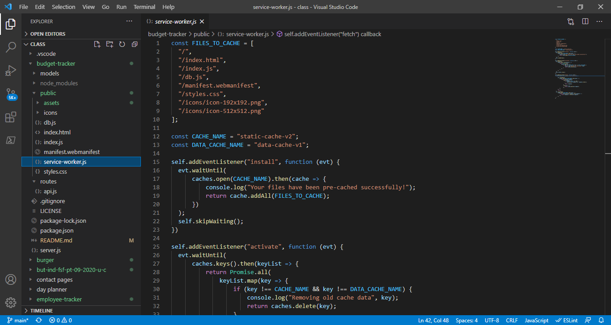
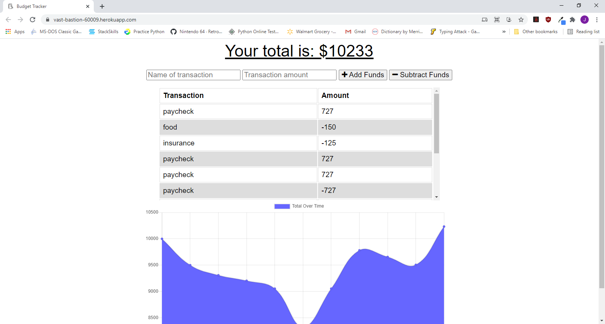

  
  # budget-tracker
 
  ## Description
  This project focuses on Progressive Web Application (PWA) to build an online budget tracker. With the use of this web page, a user can log their daily transactions whether they are online or offline. This functionality is made possible by the use of cached data, which stores static web page information that will rarely change in one collection, and offline pending budget transactions in local storage, which will push the changes to the database once an Internet connection is re-established.
  
  ## Table of Contents
  - [Title](#Title)
  - [Description](#description)
  - [Table of Contents](#table-of-contents)
  - [Screenshots](#screenshots)
  - [Installation](#installation)
  - [Usage](#usage)
  - [Testing](#testing)
  - [Additional Information](#additional-information)
  - [License](#license)
  - [Contributing](#contributing)
  - [Questions and Feedback](#questions-and-feedback)

  ## Installation
   This project is deployed at: https://vast-bastion-60009.herokuapp.com/

  ## Usage
  This project allows a user to track their budget transactions online and offline when Internet connection is unavailable.

  ## Technologies Used:
  Javascript, MongoDB, HTML, CSS, Express, Mongoose, Morgan, and Compression

  ## Code Sample
  As shown below, static files that rarely change are listed in an array, so that when the program is initially installed, it can load these files into a cached collection called static-cache-v2.
  

  ## Screenshots
  

  ## License
  MIT License - see the [LICENSE.txt](https://github.com/tussingj89/budget-tracker/blob/main/LICENSE.txt) file for details
  
  ## Testing 
  There are currently no tests available.

  ## Contributing
  When contributing to this repository, please first discuss the change you wish to make via issue, email, or any other method with the owners of this repository before making a change.
  
  ## Questions and Feedback
  Please contact me using one of the following:
  - Github: [tussingj89](https://gist.github.com/tussingj89)
  - Email: tussing40@gmail.com
